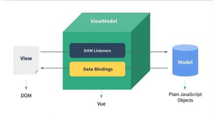
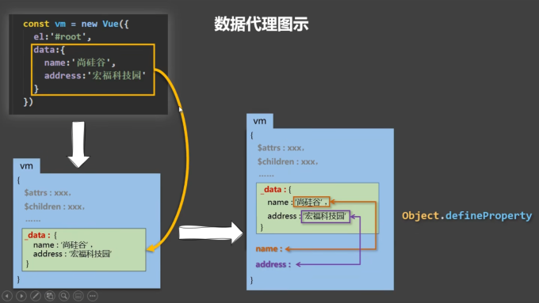
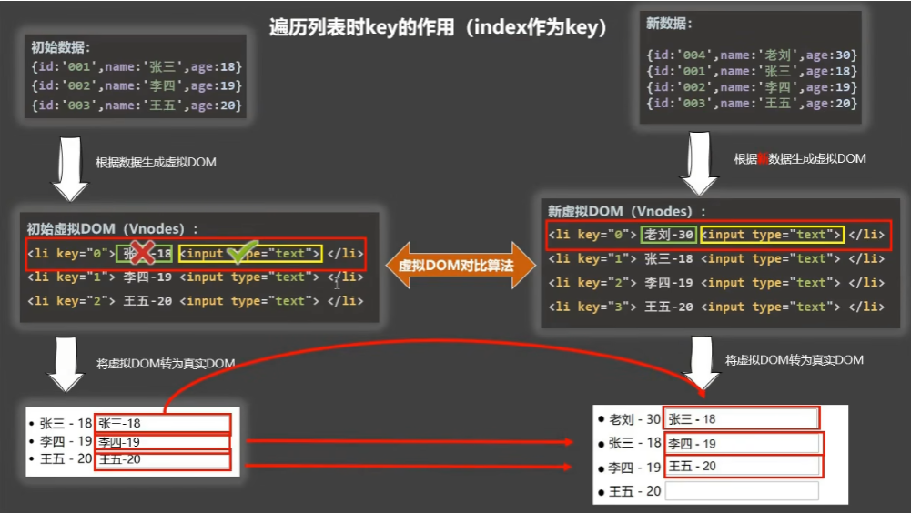

# 前端笔记
B站尚硅谷张天禹前端Vue2.0-Vue3.0学习笔记

## 学习顺序

```
1.vue基础
2.vue-cli
3.vue-router
4.vuex
5.element-ui
6.vue3
```

## 一.Vue基础

### 1.Vue简介

#### 1.1 Vue是什么？

一套用于构建用户界面的**渐进式**javaScript框架

[^渐进式]: Vue可以自底向上逐层的应用。简单应用：只需一个轻量小巧的核心库。复杂应用：可以引入各式各样的Vue插件库

#### 1.2 谁开发的？

尤雨溪。2013:seed-Vue0.6。2014:Vue0.8。 2015.10.27:Vue1.0.0。2016.10.1:Vue2.0.0。2020.09.18:Vue3.0.0。

#### 1.3 Vue优点

- 采用**组件化**模式，提高代码复用率、让代码更好维护。
- **声明式**编码，让编码人员无需直接操作DOM，提高开发效率。
- 使用**虚拟DOM**+优秀的**Diff算法**，尽可能复用DOM节点。

#### 1.4 学习Vue之前需要掌握的JavaScript基础知识？

1.ES6语法规范，2.ES6模块化，3.原型、原型链，4.数组常用方法，5.axios，6.promise，等...

[Vue官网](https://cn.vuejs.org/)

### 2.初始Vue

- 想让Vue工作，就必须创建一个Vue实例，且要传入一个配置对象；
- el容器里面的代码依然符合html规范，只不过混入了一些特殊的Vue语法；
- el容器里的代码被称为【Vue模板】；
- Vue实例和容器是一一对应的；
- 真实开发中只有一个Vue实例，并且回配合着组件一起使用；
-  {{xxx}}中的xxx要写js表达式，且xxx可以自动读取到Data中的所有属性；
- 一旦data中的数据发生改变，那么模板中用到该数据的地方也会自动更新；

### 3.模板语法

1. 插值语法：
   - 功能：用于解析标签体内容。
   - 写法：{{xxx}}，xxx是js表达式，且可以直接读取到data中的所有属性。
2. 指令语法：
   - 功能：用于解析标签（包括：标签属性、标签体内容、绑定事件...）。
   - 举例：v-bind:href="xxx" 或 简写为 :href="xxx", xxx同样要写js表达式，且可以直接读取到data中的所有属性。
   - 备注：Vue中有很多的指令，且形式都是：v-???,此处拿v-bind举例。

### 4.数据绑定

​	vue中有2种数据绑定的方式：

1. 单项绑定(v-bind)：数据只能从打他流向页面。
2. 双相绑定(v-model)：数据不仅能从data流向页面，还可以从页面流向data。
   - 双相绑定一半都应用在表单类元素上（如：input、select等）
   - v-model:value 可以简写为 v-model，因为v-model默认收集的就是value值。

#### 4.1 el与data的2种写法

1. el有2种写法
   - new Vue时候配置el属性。
   - 先创建Vue实例，随后再通过vm.$mount('#root')指定el的值。
2. data有2种写法
   - 对象式
   - 函数式
     - 如何选择：目前哪种写法都可以，以后学习到组件时，data必须使用函数式，否则会报错。
3. 一个重要的原则：
   - 由Vue管理的函数，一定不要写箭头函数，一旦写了箭头函数，this就不再是Vue实例了。

### 5.理解MVVM模型

1. M：模型(Model)：对应data中的数据
2. V：视图(View)：模板
3. VM：视图模型(ViewModel)：Vue实例对象

[](https://imgse.com/i/p9NFPyR)

观察发现：

1. data中所有的属性，最后都出现在vm身上。
2. vm身上所有的属性 及Vue原型上所有的属性，在Vue模板中都可以直接使用。

#### 5.1 数据代理

1. 回顾Object.defineProperty方法

```js
let number = 18;
let person = {
    name: '修白',
    sex:'男'
}
Object.defineProperty(person,'age',{
    // value:18,
    // enumerable:true,//控制属性是否可以枚举，默认值是false
    // writable:true,//控制属性是否可以被修改，默认值是false
    // configurable:true,//控制属性是否可以被删除，默认值是false

    // 当有人读取person的age属性时，get函数(getter)就会被调用，且返回值就是age的值
    get() {
        return number
    },
    // 当有人修改person的age属性时，set函数(setter)就会被调用，且收到修改的具体值
    set(value) {
        console.log('有人修改了age属性,且值是',value);
        number = value;
    }
})
// 不可以枚举，不参加遍历
console.log(person);
```

2. 数据代理：通过一个对象代理对另一个对象中属性的操作（读/写）

```
//例：
let obj = {x:100}
let obj2 = {y:200}
Object.defineProperty(obj2,'x',{
    get(){
    	return obj.x
    },
    set(value){
    	obj.x=value
    }
})
console.log(obj2);
```

3. Vue中的数据代理

[](https://imgse.com/i/p9UNcY8)

- Vue中的数据代理：通过vm对象来代理data对象中的属性的操作（读/写）
- Vue中数据代理的好处：更加方便的操作data中的数据
- 基本原理：
  - 通过Object.defineProperty()把data对象中所有属性添加到vm上。
  - 为每一个添加到vm上的属性，都指定一个getter/setter。
  - 在getter/setter内部去操作（读/写）data中对应的属性。

### 6.事件处理

#### 6.1. 事件的基本使用

1. 使用v-on:xxx 或 @xxx 绑定事件，其中xxx是事件名；
2. 事件的回调需要配置在**methods**对象中，最终会在vm上；
3. methods中配置的函数，不要用箭头函数！否则this就不是vm了；
4. methods中配置的函数，都是被Vue所管理的函数，this的指向是vm 或 组件实例对象；
5. @click=“demo” 和 @clik=“demo($event)” 效果一致，但后者可以传参数；

#### 6.2. Vue中的事件修饰符

1. **prevent**： 阻止默认事件（常用）；
2. **stop**：阻止事件冒泡（常用）；
3. **once**：事件只触发一次（常用）；
4. capture：使用事件的捕获模式；
5. self：只有event.target是当前操作的元素时才触发事件；
6. passive：事件的默认行为立即执行，无需等待事件回调执行完毕；


- 修饰符可以连着写。例：@click.stop.prevent

#### 6.3. 键盘事件

1. Vue中常用的案件别名：
   - 回车 => enter
   - 删除 => delete（捕获“删除”和“退格”键）
   - 退出 => esc
   - 空格 => space
   - 换行 => tab (特殊，必须配合@keyDown使用)
   - 上 => up
   - 下 => down
   - 左 => left
   - 右 => right
2. Vue未提供别名的案件，可以使用案件原始的key值去绑定，但注意要转为kebab-case（短横线命名）
3. 系统修饰键（用法特殊）：ctrl、alt、shift、meta(win)
   - 配合keyup使用：按下修饰键的同时，再按下其他键，随后释放其他键，事件才会被触发。
   - 配合keyDown使用：正常出发事件。
   - 组合键使用：.系统修饰符.按键名，例：.ctrl.y。
4. 也可以使用keyCode去指定具体的按键（不推荐）
5. Vue.config.keyCodes.自定义键名 = 键码，可以去定制按键别名。

### 7.计算属性与监视

#### 7.1. 计算属性-computed

1. 定义：要用的属性不存在，要通过已有属性计算得来。
2. 原理：底层借助了`Object.defineproperty`方法提供的`getter`和`setter`。
3. get函数什么时候执行？
   - 初次读取时会执行一次。
   - 当依赖的数据发生改变时会被再次调用。
4. 优势：与`methods`实现相比，内部有缓存机制（复用），效率高，调试方便。
5. 备注：
   - 计算属性最终会出现在vm上，直接读取使用即可。
   - 如果计算属性要被修改，那必须写set函数去响应修改，且set中要引起计算时依赖的数据发生改变。

```vue
例：
computed:{
    // 完整写法
    fullName:{
        get(){
            return this.firstName + '-' +this.lastName
        },
        set(value){
            const arr = value.split('-');
            this.firstName = arr[0];
            this.lastName = arr[1];
        }
    }
    // 简写
    fullName(){
        return this.firstName + '-' +this.lastName
    }
}
```

#### 7.2. 监视属性-watch

1. 当被监视的属性发生变化时，回调函数自动调用，进行相关操作
2. 监视的属性必须存在，才能进行监视！！！
3. 监视的两种写法：
   - new Vue时传入watch配置
   - 通过vm.$watch监视

###### 7.2.1 深度监视

1. Vue中的watch默认不检测对象内部值的改变（一层）。
2. 配置deep:true可以检测对象内部值改变（多层）。

备注：

1. Vue自身可以检测对象内部值的改变，但Vue提供的watch默认不可以！
2. 使用watch时根据数据的具体结构，决定是否采用深度监视。

#### 7.3. computed和watch之间的区别：

1. `computed`能完成的功能，watch都可以完成。
2. watch能完成的功能，`computed`不一定能完成，例如：`watch`可以进行异步操作。

两个重要的小原则：

1. 所被Vue管理的函数，最好写成普通函数，这样的this的指向才是**vm** 或 **组件实例对象**。
2. 所有不被Vue所管理的函数（定时器的回调函数、**ajax**的回调函数等,**Promise**的回调函数），最好写成箭头函数，这样this的指向才是**vm** 或者 **组件实例对象**。

### 8.绑定样式

##### 1.绑定class样式

- 写法： class="xxx" xxx可以是字符串、对象、数组。
  - 字符串写法适用于：类名不确定，要动态获取。
  - 对象写法适用于：要绑定多个样式，个数不确定，名字也不确定。
  - 数组写法适用于：要绑定多个样式，个数确定，名字也确定，但不确定用不用。

```vue
<!-- 绑定class样式 -- 字符串写法，适用于:样式的类名不确定，需要动态指定 -->
<div class="basic" :class="mood" @click="changeMood" :style="">{{name}}</div>
<br/>
<!-- 绑定class样式 -- 数组写法，适用于：要绑定的样式个数不确定、名字也不确定 -->
<div class="basic" :class="arr">{{name}}</div>
<br/>
<!-- 绑定class样式 -- 对象写法，适用于：要绑定的样式个数确定，名字也确定，但要动态决定用不用 -->
<div class="basic" :class="classObj">{{name}}</div>
<br/>
<div class="basic" :class="{atguigu1:true,atguigu2:false}">{{name}}</div>

data:{
    name: '修白',
    mood:'noormal',
    arr:['atguigu1','atguigu2','atguigu3'],
    classObj:{
        atguigu1:false,
        atguigu2:false
    }
},
methods:{
    changeMood(){
        const arr = ['happy','sad','normal']
        const index = Math.floor(Math.random()*3)
        this.mood = arr[index]
    }
}
```

##### 2.绑定style样式

- :style="{fontSize:xxx}" 其中xxx是动态值。
- :style="[a,b]" 其中a、b是样式对象。

```vue
<!-- 绑定style样式 对象写法 -->
<div class="basic" :style="styleObj">{{name}}</div>
<!-- 绑定style样式 数组写法 -->
<div class="basic" :style="[styleObj,styleObj2]">{{name}}</div>

data:{
    styleObj:{
    	fontSize:'40px'
    },
    styleObj2:{
    	backgroundColor:'red'
    }
},
```

### 9.条件渲染

###### 1.v-if 写法：

1. v-if="表达式"
2. v-else-if="表达式"
3. v-else="表达式"

适用于：切换频率较低的场景

特点：不展示的DOM袁术直接被移除

注意：v-if可以和v-else-if、v-else一起使用，但要求结构不能被“打断”。

###### 2.v-show

写法：v-show="表达式"

适用于：切换频率较高的场景

特点：不展示的DOM元素未被移除，仅仅是使用样式隐藏掉

###### 3.备注：使用v-if时，元素可能无法获取到，而使用v-show一定可以获取到。

### 10.列表渲染

##### v-for指令

1. 用于展示列表数据
2. 语法：v-for="(item,index) in xxx" :key="yyy"
3. 可遍历：数组、对象、字符串（用的很少）、指定次数（用的很少）

##### 面试题：react、vue中的key有什么作用？（key的内部原理）

1. 虚拟DOM中key的作用：

   key是虚拟DOM对象的标识，当状态中的数据发生变化时，Vue会根据【新数据】生成【新的虚拟DOM】，随后Vue进行【新虚拟Dom】与【旧虚拟Dom】的差异比较，比较规则如下：

2. 对比规则：

   - 旧虚拟DOM中找到了新虚拟DOM相同的key：
     - 若虚拟DOM中内容没变，直接使用之前的真实DOM！
     - 若虚拟DOM中内容变了，则生成新的真是DOM，随后替换掉页面中的之前的真是DOM。
   - 旧虚拟DOM中未找到与新虚拟DOM相同的key：
     - 创建新的真实DOM，随后渲染到页面。

3. 用index作为key可能会引发的问题：

   - 若对数据进行：逆序添加、逆序删除等破坏顺序操作：

     ​	会产生没有必要的真实DOM更新 ==> 界面效果没问题，但效率低。

   - 如果结构中还包含输入类的DOM：

     ​	会产生错误的DOM更新 ==> 界面有问题。

4. 开发中如何选择key？：
   - 最好使用每条数据的唯一表示作为key，比如id、手机号、身份证号、学号等唯一值。
   - 如果不存在对数据的逆序添加、逆序删除等破坏顺序操作，仅用于渲染列表用于展示，使用index作为key是没有问题的。

[](https://imgse.com/i/pCG9C01)

[](https://imgse.com/i/pCG9Fk6)

#### 10.1. Vue监视原理：

1. Vue会监视data中所有层次的数据。
2. 如何检测对象中的数据？**通过setter实现监视，且要在new Vue时就传入要检测的数据**。
   - 对象中后追加的属性，Vue默认不做响应式处理
   - 如需给后添加的属性做响应式，请使用如下API：
     - `Vue.set(target, propertyName/index, value)`
     - `vm.$set(target, propertyName/index, value)`
3. 如何监测数组中的数据？**通过包裹数组更新元素方法实现，本质就是做了两件事：**
   - 调用原生对应的方法对数组进行更新。
   - 重新解析模板，进而更新页面。
4. 在Vue修改数组中的某个元素一定要用如下方法：
   - 使用这些API：`push()`、`pop()`、`shift()`、`unshift()`、`splice()`、`sort()`、`reverse()`
   - `Vue.set()` 或 `vm.set()`

**特别注意**：Vue.set() 和 vm.set()  不能给vm 或 vm的根数据对象   添加属性！！！

### 11.收集表单数据

1. 若<input type="text"/>,则v-model收集的是value值，用户输入的就是value值。
2. 若<input type="radio"/>，则v-model收集的是value值，且要给标签配置value值。
3. <input type="checkbox"/>
   - 没有配置input的value属性，那么收集的就是checked（勾选 or 未勾选，是布尔值）
   - 配置input的value属性：
     - v-model的初始值是非数组，那么收集的就是checked（勾选 or 未勾选，是布尔值）
     - v-model的初始值是数组，那么收集的就是value组成的数组

备注： v-model的三个修饰符：

1. lazy：失去焦点再收集数据
2. number：输入字符串转为有效的数字
3. trim：输入首尾空格过滤

### 12.过滤器

定义：对要显示的数据进行特定格式化后再显示（适用于一些简单的逻辑的处理）。

语法：1. 注册过滤器：`Vue.filter(name,callback)`或`new Vue{filters:{}}`

​			2.使用过滤器：{{ xxx | 过滤器名 }} 或 v-bind:属性 = "xxx | 过滤器名"

备注：1. 过滤器也可以接收额外参数、多个过滤器也可以串联。

​			2. 并没有改变原本的数据，是产生新的对应的数据